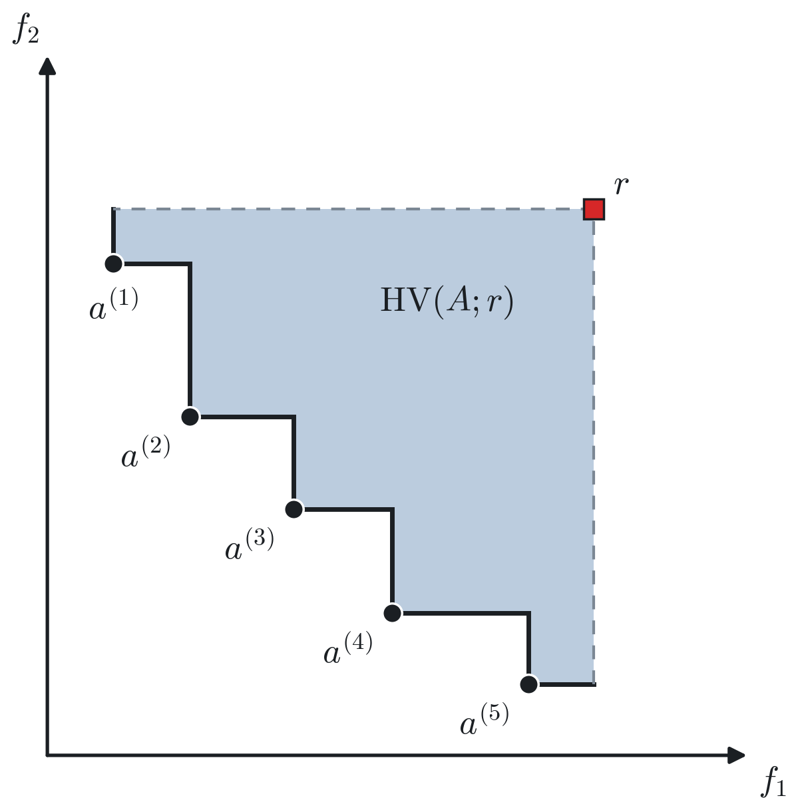
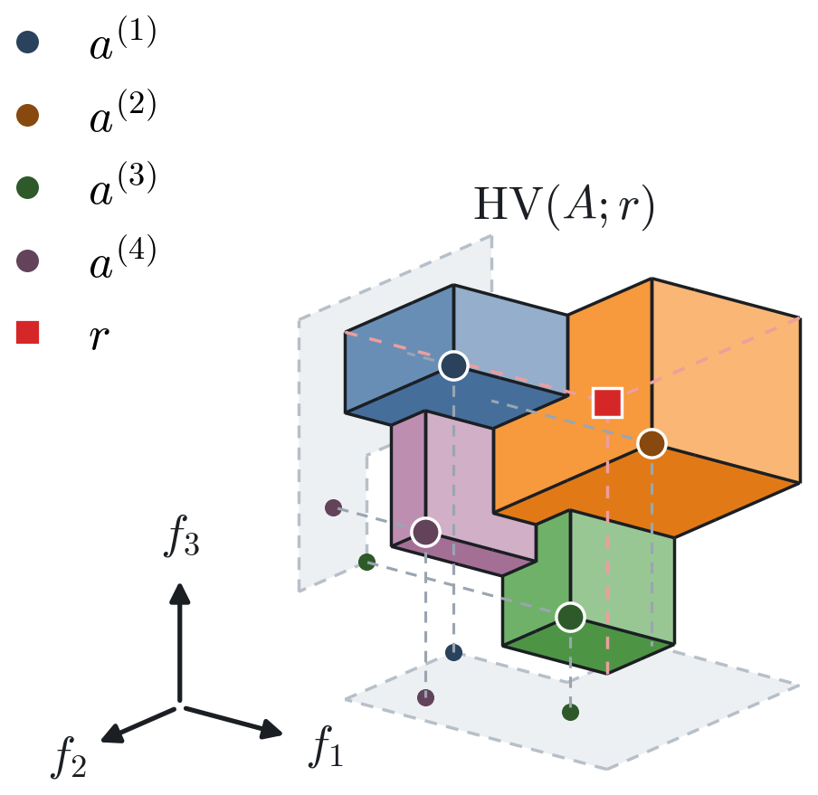

# Hypervolume-2d3d-Drawing

Reproducible drawings of the **hypervolume indicator** in two and three objectives, made for the
Wikipedia article [Hypervolume indicator](https://en.wikipedia.org/wiki/Hypervolume_indicator).
One small Python script produces both figures as SVG (for upload) and PNG (for convenience).

| 2 objectives | 3 objectives |
|---|---|
|  |  |

## What the figures show

For a minimisation problem with $m$ objectives, a finite approximation set
$A = \{a^{(1)}, \dots, a^{(n)}\} \subset \mathbb{R}^m$ and a reference point $r$ with $a_i \le r_i$,
each point spans the axis-aligned box $[a, r] = [a_1, r_1] \times \dots \times [a_m, r_m]$, and

$$\mathrm{HV}(A;r) \;=\; \lambda_m\Big(\bigcup_{a \in A} [a, r]\Big),$$

with $\lambda_m$ the $m$-dimensional Lebesgue measure: an area for $m = 2$, a volume for $m = 3$.
The shaded region in each figure is that union, and only non-dominated points contribute to it.

The 2-D region is filled in a single colour, because every part of it is dominated in the same
sense and the staircase already shows which point bounds it where. In the 3-D figure the colours are
not decoration: each visible face is coloured by the box it belongs to, i.e. by the point with the
smallest $f_3$ among those dominating that part of the plane. They are *not* the individual
hypervolume contributions, which are L-shaped and in general smaller.

The 3-D figure also shows the projections of the points and of the dominated region onto the
$f_1$–$f_2$ and $f_2$–$f_3$ planes, in grey with dashed outlines. They are the same construction one
dimension lower, and they let the reader check the dominance relations in each pair of objectives
directly — no point of a projected staircase is dominated by another one.

Further conventions: the points $a^{(i)}$ are dark discs named in the legend, the reference point $r$
is a red square, and the dashed red lines are the three *hidden* edges that meet at $r$ behind the
solid, which is what fixes its position for the reader. The 3-D figure is seen from the origin side,
because for a minimisation problem the dominated region hangs from $r$ and its staircase faces the
origin; the faces are shaded accordingly, by $|n\cdot v|$ for the viewing direction $v$, so the
undersides are darkest. The axis triad is drawn inside the same 3-D axes as the boxes, so its arrows
carry the same projection and are parallel to the box edges by construction; it is placed beside the
data rather than at the origin, because the origin plays no role in the definition of the indicator.

## Reproducing the figures

```bash
pip install -r requirements.txt
python plot_hypervolume_figures.py
```

This overwrites `hypervolume-indicator-2d.{svg,png}` and `hypervolume-indicator-3d.{svg,png}`.
Only `matplotlib` and `numpy` are needed; the figures are plotted from hard-coded coordinates, so
the output is deterministic.

## Adapting them

Everything worth changing sits at the top of `plot_hypervolume_figures.py` or in the two figure
functions:

* `PAREN = False` switches the labels from the parenthesised form $a^{(i)}$, which is the one used
  in the body of the Wikipedia article, to the plain $a^{i}$.
* The arrays `A` in `fig_2d()` and `fig_3d()` hold the objective vectors, `r` the reference point.
  Any mutually non-dominated points work; the 3-D routine recomputes the staircase from scratch.
* `PALETTE`, `INK` and `GREY` set the colours, `elev, azim` in `fig_3d()` the camera.

The SVGs are written with `svg.fonttype = "path"`, i.e. all glyphs are converted to outlines. This is
what Wikimedia Commons needs, because its renderer has only a small set of fonts available and would
otherwise substitute them. The drawback is that the labels are no longer editable as text; remove
that setting if you want translatable labels and accept the font risk.

## Licence

Copyright © 2026 Michael Emmerich.

* The **figures** (`hypervolume-indicator-*.svg`, `hypervolume-indicator-*.png`) are licensed under
  [CC BY 4.0](https://creativecommons.org/licenses/by/4.0/), see `LICENSE-CC-BY-4.0`, which is
  compatible with Wikimedia Commons.
* The **code** (`plot_hypervolume_figures.py`) is licensed under the MIT License, see `LICENSE`.
  Creative Commons licences are not intended for software.
